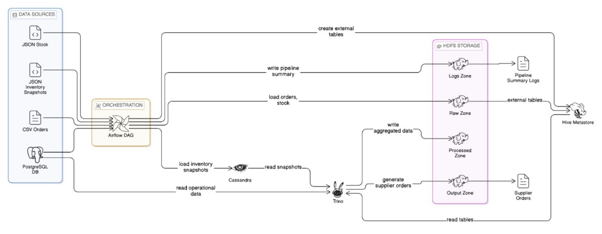

# Procurement System BigData Pipeline

A comprehensive Big Data procurement management system built with modern data engineering technologies. This project implements an end-to-end ETL pipeline that processes procurement data, calculates inventory requirements, and generates automated supplier orders using federated queries across multiple data sources.

## 🏗️ Architecture Overview

This system orchestrates a complex data pipeline using Apache Airflow to coordinate data ingestion, processing, and analytics across a distributed Big Data stack:

<p align="center">
  
</p>

### Core Components

- **Apache Airflow**: Workflow orchestration and scheduling
- **Hadoop HDFS**: Distributed file storage for raw and processed data
- **Apache Hive**: Data warehousing and SQL-like queries on HDFS
- **Apache Cassandra**: NoSQL database for high-throughput inventory snapshots
- **Trino**: Federated query engine for cross-system analytics
- **PostgreSQL**: Relational database for master data and metadata

## 📊 Data Flow

The daily pipeline executes 8 sequential tasks:

1. **Load Orders to HDFS**: Ingest daily order data from CSV files
2. **Load Stock to HDFS**: Convert JSON stock data to CSV and store in HDFS
3. **Store Snapshots to Cassandra**: Insert inventory snapshots for real-time availability
4. **Create Hive Tables**: Set up external tables pointing to HDFS data
5. **Aggregate Orders**: Use Trino to join orders with product/warehouse metadata
6. **Calculate Net Demand**: Compute inventory requirements using federated queries
7. **Generate Supplier Orders**: Create automated purchase orders based on demand
8. **Pipeline Summary**: Generate comprehensive execution report

## 🗂️ Data Model

### Master Data (PostgreSQL)
- **Suppliers**: 35 Moroccan suppliers with contact details and status
- **Products**: 40 SKUs across categories (Office Supplies, IT Equipment, Safety, etc.)
- **Warehouses**: 10 distribution centers across Moroccan cities
- **Supplier-Product Relationships**: Procurement rules, pricing, and lead times
- **Safety Stock**: Global and warehouse-specific inventory thresholds

### Transactional Data
- **Orders**: Daily procurement orders with supplier, SKU, quantity, and warehouse
- **Stock Levels**: Current inventory by warehouse and SKU
- **Inventory Snapshots**: Daily availability and reservations in Cassandra

### Processed Outputs
- **Aggregated Orders**: Summarized order data with product and location details
- **Net Demand Calculations**: Inventory requirements considering orders, safety stock, and current levels
- **Supplier Orders**: Generated purchase orders with optimal suppliers and quantities

## 🚀 Quick Start

### Prerequisites
- Docker and Docker Compose
- 8GB+ RAM available
- 20GB+ free disk space

### Installation

1. **Clone the repository**
   ```bash
   git clone https://github.com/isMarouaneBen/procurement-system-BigData.git
   cd procurement-system-BigData
   ```

2. **Start the complete stack**
   ```bash
   docker-compose up -d
   ```

3. **Wait for services to initialize** (5-10 minutes)
   - Check service health: `docker-compose ps`
   - View logs: `docker-compose logs -f airflow-webserver`

4. **Access the interfaces**
   - **Airflow UI**: http://localhost:8080 (admin/admin123)
   - **Trino UI**: http://localhost:8081
   - **HDFS Namenode**: http://localhost:9870
   - **PgAdmin**: http://localhost:5050 (admin@procurement.com/admin123)

### Generate Sample Data

Run the data generation script to create realistic procurement data:

```bash
docker-compose exec airflow-webserver python /opt/airflow/scripts/generateData.py
```

This generates:
- 1000+ orders in CSV format
- Stock levels for 400+ warehouse-SKU combinations
- Inventory snapshots for Cassandra

### Execute the Pipeline

1. **Access Airflow UI** at http://localhost:8080
2. **Unpause the DAG**: `procurement_daily_pipeline_sequential`
3. **Trigger manually** or wait for scheduled execution (23:00 daily)
4. **Monitor execution** through the Airflow interface

## 📁 Project Structure

```
procurement-system-BigData/
├── dags/
│   └── pipeline.py              # Main Airflow DAG definition
├── scripts/
│   └── generateData.py          # Sample data generation
├── data/                        # Local data directory (mounted)
├── logs/                        # Airflow execution logs
├── plugins/                     # Airflow custom plugins
├── trino/
│   └── etc/                     # Trino configuration
│       ├── catalog/             # Data source catalogs
│       └── *.properties         # Trino settings
├── init-scripts/                # Database initialization
│   ├── postgres/                # PostgreSQL schema & data
│   ├── cassandra/               # Cassandra keyspace setup
│   ├──── hdfs/                    # HDFS directory structure
│  
├── docker-compose.yaml          # Complete stack orchestration
├── Dockerfile                   # Airflow container definition
├── requirements.txt             # Python dependencies
└── README.md
```

## 🔧 Configuration


### Data Paths

- **HDFS Base**: `/procurement`
  - Raw data: `/procurement/raw/`
  - Processed: `/procurement/processed/`
  - Output: `/procurement/output/`
  - Logs: `/procurement/logs/`

- **Local Data**: `/opt/airflow/data/`
  - Raw: `data/raw/`
  - Processed: `data/processed/`
  - Logs: `data/logs/`

## 📈 Key Features

### Federated Analytics
- **Cross-System Queries**: Join HDFS data with PostgreSQL metadata and Cassandra snapshots
- **Real-time Insights**: Query across 3 different storage systems simultaneously
- **Performance**: Trino optimizes distributed queries across the stack

### Automated Procurement
- **Demand Calculation**: Considers orders, safety stock, and current inventory
- **Supplier Optimization**: Selects lowest-cost suppliers meeting requirements
- **Pack Size Compliance**: Ensures orders meet minimum quantities and pack sizes
- **Lead Time Planning**: Factors supplier lead times into order scheduling

### Scalable Architecture
- **Distributed Storage**: HDFS handles large-scale data ingestion
- **NoSQL Flexibility**: Cassandra manages high-volume inventory snapshots
- **Relational Integrity**: PostgreSQL maintains master data consistency
- **Containerized Deployment**: Easy scaling and environment management

## 🔍 Monitoring & Observability

### Pipeline Monitoring
- **Airflow UI**: Real-time DAG execution status and logs
- **Task Logs**: Detailed execution logs stored in HDFS
- **Exception Tracking**: Failed task logs with full stack traces
- **Performance Metrics**: Execution times and data volumes

### Data Quality
- **Row Count Validation**: Verifies data integrity across transformations
- **Schema Enforcement**: Hive tables ensure consistent data structure
- **Audit Trails**: Complete execution history with timestamps

### System Health
- **Service Healthchecks**: Automated monitoring of all components
- **Resource Usage**: Container resource limits and monitoring
- **Data Volumes**: Persistent storage for all databases and HDFS

## 🛠️ Development

### Adding New Tasks
1. Define Python functions in `dags/pipeline.py`
2. Add to Airflow DAG with proper dependencies
3. Update XCom keys for data passing
4. Test locally before deployment

### Modifying Data Models
1. Update PostgreSQL schema in `init-scripts/postgres/init.sql`
2. Modify Trino queries in pipeline tasks
3. Update data generation scripts
4. Rebuild containers: `docker-compose up --build`

### Custom Queries
Access Trino at http://localhost:8081 for ad-hoc queries:

```sql
-- Example: Check current inventory across systems
SELECT
    p.name as product_name,
    w.city as warehouse_city,
    s.available_qty,
    s.reserved_qty
FROM postgresql.procurement_system.products p
JOIN cassandra.procurement.procurement.inventory_snapshots s
    ON p.sku_code = s.sku_code
JOIN postgresql.procurement_system.warehouses w
    ON s.warehouse_code = w.warehouse_code
WHERE s.snapshot_date = CURRENT_DATE;
```

## 📚 API Reference

### Trino Catalogs
- `postgresql.procurement_system.*`: Master data tables
- `hive.procurement.*`: Processed data tables
- `cassandra.procurement.*`: Inventory snapshots

### Key Tables
- **orders**: Daily procurement orders
- **stock**: Current inventory levels
- **aggregated_orders**: Summarized order analytics
- **net_demand**: Calculated inventory requirements
- **supplier_orders**: Generated purchase orders

## 🤝 Contributing

1. Fork the repository
2. Create a feature branch
3. Make changes with proper testing
4. Submit a pull request with detailed description


## 🏆 Acknowledgments

Built with modern Big Data technologies:
- Apache Airflow for orchestration
- Trino for federated analytics
- Hadoop ecosystem for storage and processing
- Cassandra for high-throughput NoSQL operations
- PostgreSQL for transactional data integrity
